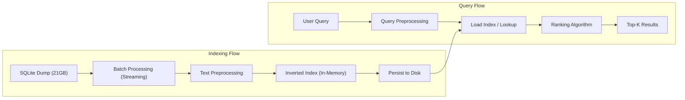

# Wikipedia Search Engine

A simple search engine built on top of a Wikipedia dataset, demonstrating core information retrieval concepts like inverted indexing and text preprocessing.

---

## Features

- Search Wikipedia articles by keyword  
- Inverted index for fast lookup  
- Text preprocessing:
  - Lowercasing  
  - Tokenization  
  - Stopword removal  
- Basic ranking using term frequency  

---

## Architecture



---

## Tech Stack

- Python  
- SQLite  

---

## Dataset

- Wikipedia dump (`enwiki-20170820.db`)

### Schema:
```sql
CREATE TABLE ARTICLES (
  ARTICLE_ID INTEGER,
  TITLE TEXT,
  SECTION_TITLE TEXT,
  SECTION_TEXT TEXT
);
```

## Next Steps

### Search Quality Improvements
- Implement **TF-IDF / BM25 ranking** for better relevance  

### Performance & Scalability
- Move from in-memory index to a **disk-based inverted index** (optimized for 21GB+)  
- Implement **caching layer** (e.g., Redis) for frequent queries  
- Enable **parallel indexing** for faster preprocessing  

### Advanced Features
- Add **autocomplete / typeahead suggestions**  
- Implement **highlighting of matched terms** in results  
- Support **filters** (by section, title, etc.)  