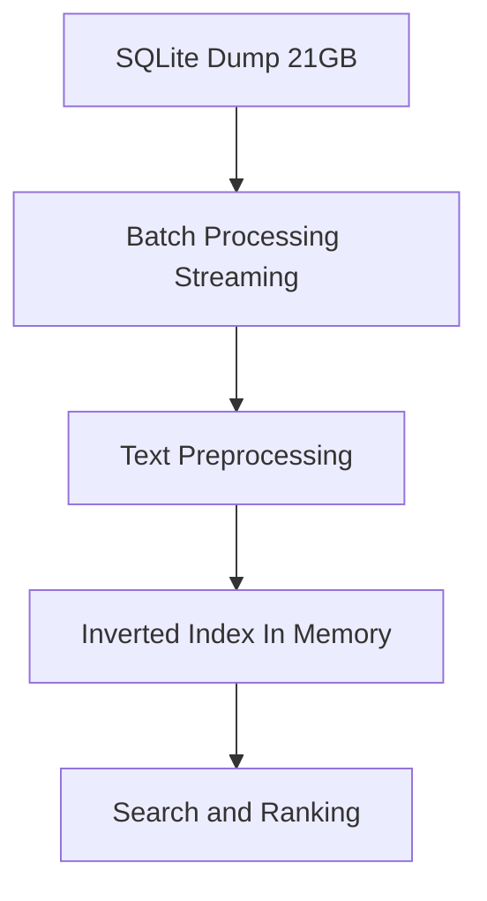

# Wikipedia Search Engine

A simple search engine built on top of a Wikipedia dataset, demonstrating core information retrieval concepts like inverted indexing and text preprocessing.

---

## Features

- Search Wikipedia articles by keyword  
- Inverted index for fast lookup  
- Text preprocessing:
  - Lowercasing  
  - Tokenization  
  - Stopword removal  
- Basic ranking using term frequency  

---

## Architecture



---

## Tech Stack

- Python  
- SQLite  

---

## Dataset

- Wikipedia dump (`enwiki-20170820.db`)

### Schema:
```sql
CREATE TABLE ARTICLES (
  ARTICLE_ID INTEGER,
  TITLE TEXT,
  SECTION_TITLE TEXT,
  SECTION_TEXT TEXT
);